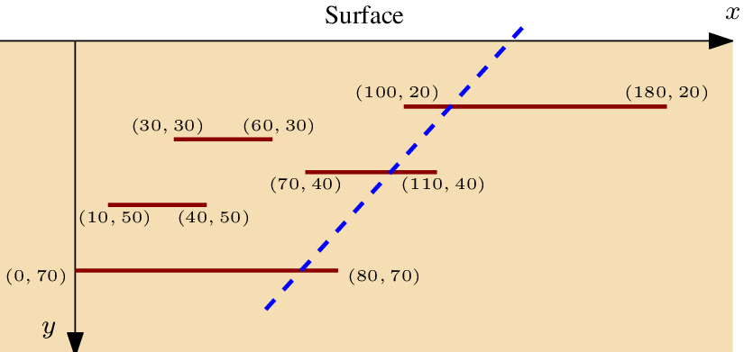

#### Credits

From the Effective Programming course taught at Université Paris Cité by Dominique Poulalhon and François Laroussinie.

## Oil wells

You work for an oil company and are responsible for optimising
drilling. After decades of exploitation, drilling is becoming increasingly difficult: newly discovered deposits are often fragmented, which affects well productivity. You are being asked to consider the case of _stratified_ deposits, i.e. deposits made up of several sub-deposits at different depths. You begin by studying a simplified 2-dimensional model, where the different reservoirs are modelled by segments parallel to the surface, as in the image below:

<div style="text-align: center;">
    
</div>

You need to determine how to drill a single well to maximise its production. Drilling must be done in a single straight line, and it is assumed that the oil from each field crossed by the well be extracted (even if the intersection is at the end of the field). The capacity of each reservoir is equated
to its width.

#### Objective

Determine the maximum quantity of oil that can be extracted by drilling a single well.

#### Input

Instances are provided in files with the following format:

```bash
n           # number of oil fields
x01 x11 y1  # coordinates of the first oil field: from (x01, y1) to (x11, y1)
x02 x12 y2  # coordinates of the second oil field: from (x02, y2) to (x12, y2)
...
x0n x1n yn  # coordinates of the nth oil field: from (x0n, yn) to (x1n, yn)
```

Constraints on the parameters: 1 ≤ `n` ≤ 2000, `|x0i|`, `|x1i|` ≤ 10^6, 1 ≤ `yi` ≤ 10^6.
The oil fields do not intersect each other (even at the endpoints).

#### Output

The output file consists of a single line containing the maximum extraction capacity of a well.

#### Examples

For the following input file:

```bash
5
100 180 20
30 60 30
70 110 40
10 40 50
0 80 70
```

the expected output is

```bash
200
```

while for the input file

```bash
3
50 60 10
-42 -42 20
25 0 10
```

the expected output is

```bash
25
```
